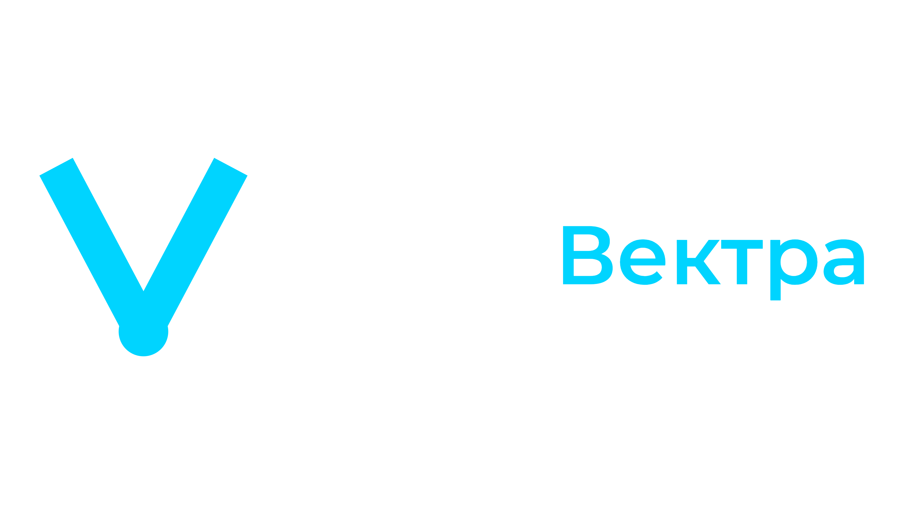
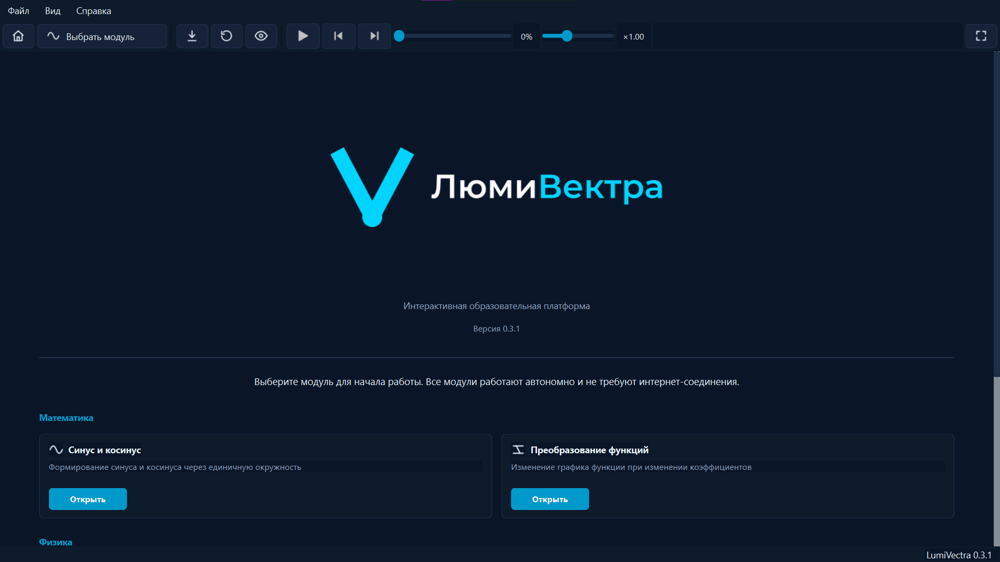

  <picture>
    <source media="(prefers-color-scheme: dark)"
            srcset="docs/logo_dark.png">
    <source media="(prefers-color-scheme: light)"
            srcset="docs/logo_light.png">
    
  </picture>

**Интерактивная образовательная платформа** для уроков физики и математики.
Набор визуализаций, демонстрирующих физические и математические модели
в реальном времени.

---

## Скачать

Готовый установщик — в публичном репозитории:

**[github.com/J7sychologist/LumiVectra_releases/releases](https://github.com/J7sychologist/LumiVectra_releases/releases)**

1. [Скачать последнюю версию](https://github.com/J7sychologist/LumiVectra_releases/releases/latest).
2. Запустите — установка проходит без прав администратора.
3. Ярлык появится на рабочем столе и в меню «Пуск».

Приложение обновляется автоматически при запуске. **Python не требуется.**

---

## Возможности

**Модули:**

| Модуль | Предмет | Тема |
| :--- | :--- | :--- |
| **Sin_cos** | Математика | Тригонометрия, единичная окружность |
| **Functions** | Математика | Преобразование графиков функций |
| **Oscillator** | Физика | Затухающие механические колебания |
| **Incline** | Физика | Брус на наклонной плоскости, силы, трение |
| **Curvature** | Физика | Криволинейное движение, МЦС, центр кривизны |

**Интерфейс:**

- Тёмная и светлая темы, 3 размера текста
- Единая панель расчётов во всех модулях
- Глобальное управление анимацией (пуск, пауза, шаг, скорость)
- Зум колёсиком мыши и панорамирование графиков (Functions, Oscillator)
- Экспорт кадра в PNG
- Автообновление через GitHub Releases

**Горячие клавиши:**

| Клавиша | Действие |
| :--- | :--- |
| `Ctrl+H` | Главная страница |
| `Ctrl+I` | Показать / скрыть расчёты |
| `Ctrl+S` | Сохранить кадр в PNG |
| `Ctrl+0` | Сбросить зум и панорамирование графика |
| `Ctrl+1…9` | Быстрый переход к модулю |
| `Space` | Пуск / пауза (в анимации) |
| `A` / `D` | Шаг назад / вперёд |
| `R` | Сброс |
| `1…4` | Переключить векторы |

---

## Системные требования

Windows 10/11 (x64), 4 ГБ ОЗУ, 200 МБ на диске.
**Python не требуется.**

---

## Использование в образовании

Платформа создана для использования в образовательных организациях
(10–11 классы). По вопросам сотрудничества обращайтесь к автору.

---

## Лицензия

© 2026 Sizasko V. Все права защищены.

Программа распространяется по проприетарной лицензии.
Исходный код и условия использования — см. файл `LICENSE`.
Список сторонних компонентов и их лицензий — см. файл `NOTICE`.

---

## Контакты

**Автор:** Сизаско В.
**E-mail:** [VSizasko@sfu-kras.ru](mailto:VSizasko@sfu-kras.ru)
**Репозиторий:** [github.com/J7sychologist/LumiVectra_releases](https://github.com/J7sychologist/LumiVectra_releases)

По вопросам сотрудничества, использования в образовательных
организациях и коммерческого лицензирования — пишите на e-mail.
